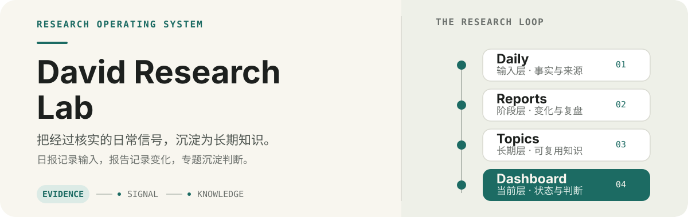
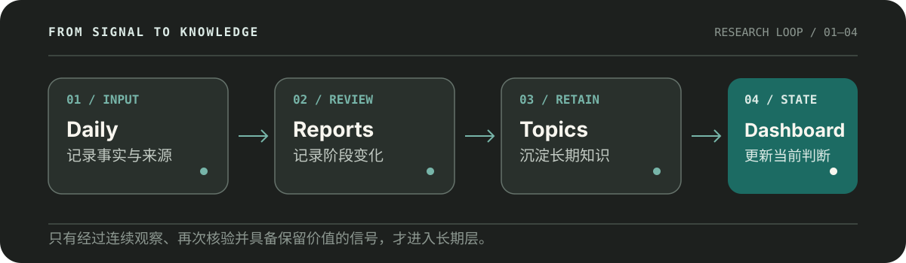

# David Research Lab

  

David Research Lab 是一个长期维护的中文研究知识库：把经过核实的日常信息，转成可回看的阶段报告、可复用的长期专题，以及用于快速判断的趋势仪表盘。

> 不是新闻收藏夹，而是一套持续把信息变成知识的研究系统。

## 从这里开始

| 想了解什么 | 入口 | 你会看到什么 |
|---|---|---|
| 现在怎么看 | [Dashboard](./dashboards/index.md) | 各领域当前状态、趋势等级和一句话判断 |
| 今天发生了什么 | [Daily](./daily/) | 经过核实的事件、来源、公众反应和初步信号 |
| 最近发生了什么变化 | [Reports](./reports/) | 周报、月报、阶段复盘和专题性总结 |
| 长期怎么看 | [Topics](./topics/) | AI、半导体、网络安全、数字化等可持续更新的知识 |

  

## 当前栏目

- [科技趋势日报](./daily/tech/)：承接 AI、算力、半导体、数字治理和其他科技趋势的每日输入。
- [游戏日报](./daily/game/)：记录游戏新闻、玩家态度、平台变化和产业信号。
- [2026 世界杯专区](./daily/world-cup-2026/)：保存赛事期间的日报、动态总览和最终复盘。

这些栏目是输入层，不直接等同于长期结论。只有经过连续观察、再次核验并具备保留价值的信号，才会上升到 Report、Topic 或 Dashboard。

## 研究结构

| 层级 | 回答的问题 | 主要内容 |
|---|---|---|
| **Daily** | 今天发生了什么？ | 事件、来源、初步影响和后续观察 |
| **Reports** | 最近发生了什么变化？ | 按时间组织的周报、月报和阶段复盘 |
| **Topics** | 长期怎么看？ | 产业结构、发展阶段、长期趋势和观察指标 |
| **Dashboard** | 现在怎么看？ | 当前状态、趋势等级和简短判断 |

## 当前研究面

- [AI](./topics/ai.md) · Agent、算力、企业应用、治理与资本回报
- [半导体](./topics/semiconductor.md) · 芯片、存储、先进封装与供应链
- [网络安全](./topics/cybersecurity.md) · 数据安全、零信任、Agent 权限与供应链风险
- [企业数字化](./topics/digital-transformation.md) · 数据治理、组织变革与国企数字化
- [低空经济](./topics/low-altitude-economy.md) · 空域、基础设施与商业化验证
- [机器人](./topics/robotics.md) · 人形机器人、智能制造与真实应用
- [宏观经济](./topics/macroeconomy.md) · 利率、通胀、能源、汇率与资本开支
- [游戏产业](./topics/game-industry.md) · 平台竞争、内容消费与跨媒体 IP

## 常用指令

日常维护可以直接提出目标，不需要先理解仓库内部路径：

- 更新本周周报
- 更新 Dashboard
- 更新 AI Topic
- 更新半导体 Topic
- 更新网络安全 Topic
- 更新本月月报
- 做季度、半年或年度复盘

具体文件位置和最小修改范围，由 [AGENTS.md](./AGENTS.md) 与 [USER_GUIDE.md](./USER_GUIDE.md) 约束。

## 研究原则

- 事实、判断和假设分开写，来源要能回读。
- 少罗列新闻，多解释趋势；少情绪，多证据。
- 不用单条新闻推导确定性结论，也不把短期市场情绪当作长期趋势。
- 投资相关内容只做行业与资产方向观察，不直接给出个股买卖指令，不承诺收益。
- 数据用于支撑判断，不为堆砌统计而增加正文负担。

## 维护入口

- [项目背景](./PROJECT_CONTEXT.md)
- [研究方法论](./RESEARCH_PHILOSOPHY.md)
- [编辑政策](./EDITORIAL_POLICY.md)
- [AI 协作规范](./AGENTS.md)
- [使用手册](./USER_GUIDE.md)
- [更新日志](./CHANGELOG.md)

David Research Lab 的目标不是积累最多文件，而是持续留下未来仍然可复用的研究判断。
