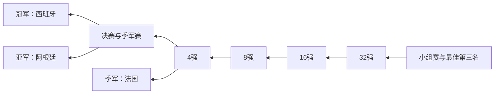

# 2026 世界杯动态总览

更新时间：2026-06-22 12:00 CST  
当前阶段：小组赛第二轮

本页是世界杯专区的动态状态页。每日新闻持续新增，本页只保留最新的前三名预测、比赛阶段、晋级状态和潜在淘汰赛路径。

## 当前最可能的前三名

| 预测位置 | 球队 | 当前状态 | 核心依据 | 最大风险 |
|---:|---|---|---|---|
| 冠军 | 西班牙 | H 组 4 分，掌握头名主动 | 控场、压迫和阵容深度在第二轮明显恢复 | 面对低位防守仍可能失速 |
| 亚军 | 阿根廷 | J 组竞争中 | 大赛经验、核心状态和比赛成熟度突出 | 阵容年龄及核心依赖 |
| 季军 | 法国 | I 组竞争中 | 阵容天赋、替补深度和容错率高 | 战术稳定性与伤停 |

紧随其后：德国、英格兰、巴西。

## 反向争冠路径

这张图从当前比赛阶段逐步收束到前三名预测。球队和路径会随每日赛果更新。

## 当前小组与晋级状态

| 小组 | 当前领跑或有利球队 | 竞争状态 | 重点风险 |
|---|---|---|---|
| G | 埃及 4 分 | 伊朗保持竞争力；比利时末轮承压 | 比利时进攻低效，第三名比较可能介入 |
| H | 西班牙 4 分 | 乌拉圭、佛得角同为 2 分 | 末轮净胜球和最佳第三名比较关键 |
| I | 待 6 月 22 日比赛更新 | 法国、挪威、塞内加尔等继续竞争 | 法国表现将影响争冠评价 |
| J | 待 6 月 22 日比赛更新 | 阿根廷、奥地利等继续竞争 | 阿根廷能否锁定有利路径 |

其余小组将在下一次自动更新时依据 FIFA 官方积分榜补齐并统一维护。

## 晋级与淘汰跟踪

### 已锁定小组第一或明显有利

- 德国：已提前锁定小组第一。
- 美国：已提前锁定小组第一。
- 西班牙：掌握 H 组头名主动权，但尚待末轮确认。

### 出线形势上升

- 埃及：4 分，占据 G 组主动。
- 佛得角：连续逼平西班牙和乌拉圭，具备现实晋级机会。
- 日本：大比分获胜后，体系和净胜球优势明显。

### 出线或评价承压

- 比利时：两轮运动战进攻低效，末轮压力明显。
- 乌拉圭：两轮仅 2 分，需要在末轮对西班牙拿分。

### 已淘汰

- 暂无在本页数据截止时间前确认的新增淘汰球队。

## 淘汰赛路径观察

| 球队 | 当前目标 | 路径判断 |
|---|---|---|
| 西班牙 | H 组第一 | 争取避开更早遭遇其他第一梯队球队 |
| 阿根廷 | J 组第一 | 若稳定拿下小组头名，淘汰赛主动性更高 |
| 法国 | I 组第一 | 小组表现将决定是否继续保有高容错路径 |
| 德国 | 已锁定小组第一 | 当前路径确定性高，是前三名预测的第一替补 |

## 每日更新规则

- 日报新增历史记录，本页覆盖更新。
- 只采用已经结束并确认的比赛结果。
- 每天更新前三名预测及升降理由。
- 每天更新晋级、淘汰、最佳第三名和淘汰赛路径。
- 小组赛结束后，本页切换为完整 32 强淘汰赛树。
- 世界杯结束后，本页冻结为最终赛事总览。
